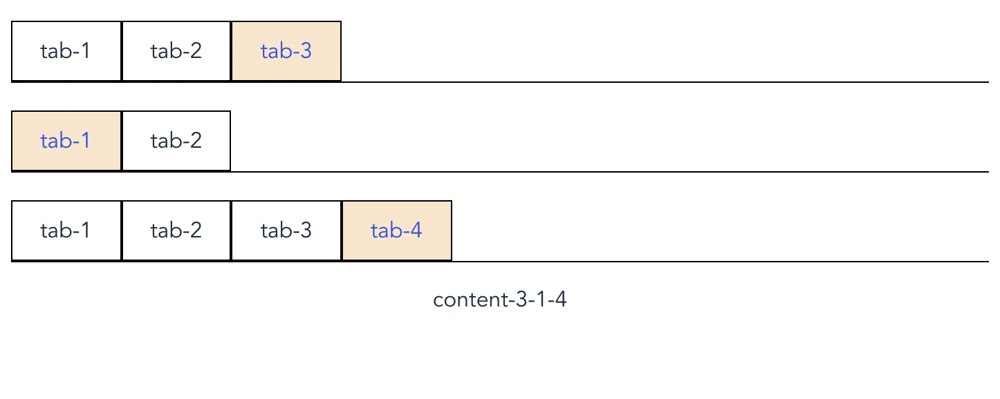

# sub-components

类似于Vue中[component](https://cn.vuejs.org/v2/api/#component)的理念。渲染一个“元组件”为动态组件。根据传入 com 的值，来决定哪个组件被渲染。

区别点在于`sub-components`支持不定层级的“元组件”的渲染。

## 用法示例

1. `npm install sub-components`
2. 在页面中引用sub-components和元组件（以Tabs组件为例）
```javaScript
import SubComponents from "sub-components";
import Tabs from "./components/tabs";
export default {
  components: {
    SubComponents,
    Tabs,
  },
```
3. 在html中使用该组件，com中传入元组件的名称
```html
<sub-components
  com="Tabs"
  :dataList="tabData"
  transferLevel
  @switchTab="switchTab"
>
  <p>{{ content }}</p>
</sub-components>
<script>
export default {
  // ...
  data() {
    return {
      tabData: [
        [1, 2, 3],
        [1, 2],
        [1, 2, 3, 4]
      ],
      path: [0, 0, 0],
    };
  },
  computed: {
    content: function() {
      return 'content' + this.path.reduce((acc, cur) => acc + '-' + (cur + 1), '');
    },
  },
  methods: {
    switchTab(data) {
      const { level, index } = data;
      this.$set(this.path, level, index);
    },
  },
}
</script>
```
4. 效果展示



## 属性

### Attributes

| 参数          | 说明                         | 类型            | 默认值                                       | 必选 |
| ------------- | ---------------------------- | --------------- | -------------------------------------------- | ---- |
| com           | 元组件的名称                 | string          |                                              | 必选 |
| dataType      | 元组件的属性名               | string          | "data"                                       |      |
| dataList      | 元组件的数据列表             | array \| number | 1                                            | 必选 |
| range         | 层级([min, max])             | array           | [this.dataList.length, this.dataList.length] |      |
| transferLevel | 是否传递层级索引level到组件props | boolean         | false                                        |      |
| config        | 具体配置                     | Object          | {}                                           |      |


### slots

| Name         | 说明                                                         | scoped                                              |
| ------------ | ------------------------------------------------------------ | --------------------------------------------------- |
| -            | 自定义内容（default）                                        | -                                                   |
| levelControl | 层级控制（index 当前层级索引；increase 可增大；decrease 可减小） | {index: number,increase: boolean,decrease: boolean} |

## 本地开发

+ `git clone https://github.com/xichi/vue-sub-components`
+ `npm install`
+ `npm run dev`
